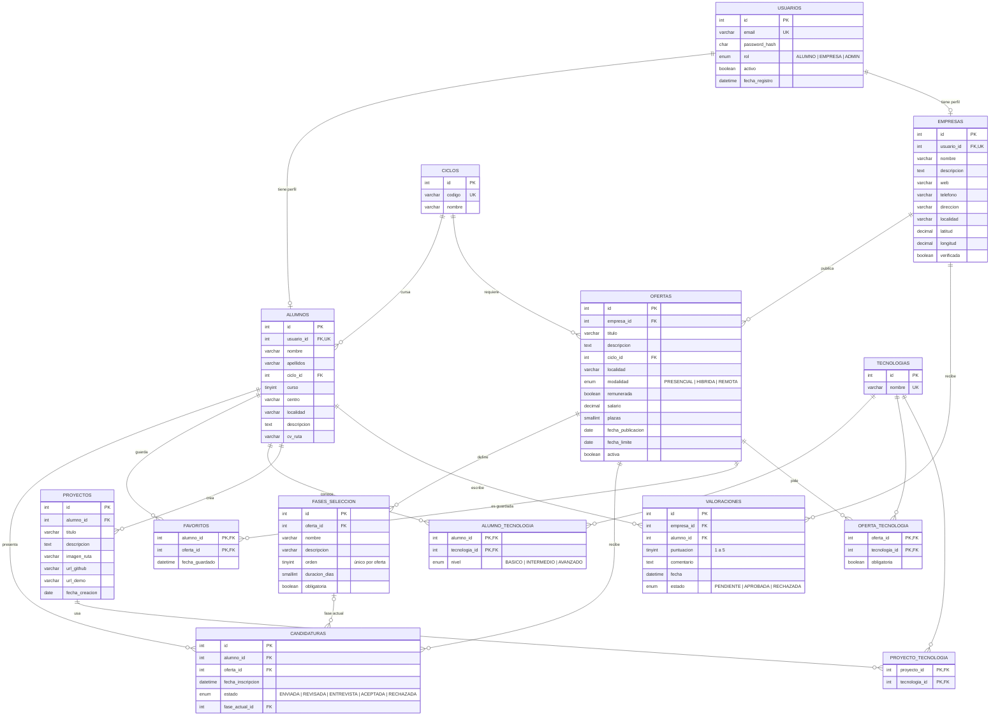

# Modelo entidad-relación

```mermaid
erDiagram
    USUARIOS ||--o| ALUMNOS : "tiene perfil"
    USUARIOS ||--o| EMPRESAS : "tiene perfil"
    CICLOS ||--o{ ALUMNOS : "cursa"
    CICLOS ||--o{ OFERTAS : "requiere"
    EMPRESAS ||--o{ OFERTAS : "publica"
    OFERTAS ||--o{ FASES_SELECCION : "define"
    ALUMNOS ||--o{ CANDIDATURAS : "presenta"
    OFERTAS ||--o{ CANDIDATURAS : "recibe"
    FASES_SELECCION |o--o{ CANDIDATURAS : "fase actual"
    ALUMNOS ||--o{ FAVORITOS : "guarda"
    OFERTAS ||--o{ FAVORITOS : "es guardada"
    ALUMNOS ||--o{ ALUMNO_TECNOLOGIA : "conoce"
    TECNOLOGIAS ||--o{ ALUMNO_TECNOLOGIA : ""
    OFERTAS ||--o{ OFERTA_TECNOLOGIA : "pide"
    TECNOLOGIAS ||--o{ OFERTA_TECNOLOGIA : ""
    ALUMNOS ||--o{ PROYECTOS : "crea"
    PROYECTOS ||--o{ PROYECTO_TECNOLOGIA : "usa"
    TECNOLOGIAS ||--o{ PROYECTO_TECNOLOGIA : ""
    ALUMNOS ||--o{ VALORACIONES : "escribe"
    EMPRESAS ||--o{ VALORACIONES : "recibe"

    USUARIOS {
        int id PK
        varchar email UK
        char password_hash
        enum rol "ALUMNO | EMPRESA | ADMIN"
        boolean activo
        datetime fecha_registro
    }
    CICLOS {
        int id PK
        varchar codigo UK
        varchar nombre
    }
    ALUMNOS {
        int id PK
        int usuario_id FK,UK
        varchar nombre
        varchar apellidos
        int ciclo_id FK
        tinyint curso
        varchar centro
        varchar localidad
        text descripcion
        varchar cv_ruta
    }
    EMPRESAS {
        int id PK
        int usuario_id FK,UK
        varchar nombre
        text descripcion
        varchar web
        varchar telefono
        varchar direccion
        varchar localidad
        decimal latitud
        decimal longitud
        boolean verificada
    }
    OFERTAS {
        int id PK
        int empresa_id FK
        varchar titulo
        text descripcion
        int ciclo_id FK
        varchar localidad
        enum modalidad "PRESENCIAL | HIBRIDA | REMOTA"
        boolean remunerada
        decimal salario
        smallint plazas
        date fecha_publicacion
        date fecha_limite
        boolean activa
    }
    TECNOLOGIAS {
        int id PK
        varchar nombre UK
    }
    ALUMNO_TECNOLOGIA {
        int alumno_id PK,FK
        int tecnologia_id PK,FK
        enum nivel "BASICO | INTERMEDIO | AVANZADO"
    }
    OFERTA_TECNOLOGIA {
        int oferta_id PK,FK
        int tecnologia_id PK,FK
        boolean obligatoria
    }
    FASES_SELECCION {
        int id PK
        int oferta_id FK
        varchar nombre
        varchar descripcion
        tinyint orden "único por oferta"
        smallint duracion_dias
        boolean obligatoria
    }
    CANDIDATURAS {
        int id PK
        int alumno_id FK
        int oferta_id FK
        datetime fecha_inscripcion
        enum estado "ENVIADA | REVISADA | ENTREVISTA | ACEPTADA | RECHAZADA"
        int fase_actual_id FK
    }
    FAVORITOS {
        int alumno_id PK,FK
        int oferta_id PK,FK
        datetime fecha_guardado
    }
    PROYECTOS {
        int id PK
        int alumno_id FK
        varchar titulo
        text descripcion
        varchar imagen_ruta
        varchar url_github
        varchar url_demo
        date fecha_creacion
    }
    PROYECTO_TECNOLOGIA {
        int proyecto_id PK,FK
        int tecnologia_id PK,FK
    }
    VALORACIONES {
        int id PK
        int empresa_id FK
        int alumno_id FK
        tinyint puntuacion "1 a 5"
        text comentario
        datetime fecha
        enum estado "PENDIENTE | APROBADA | RECHAZADA"
    }
```
